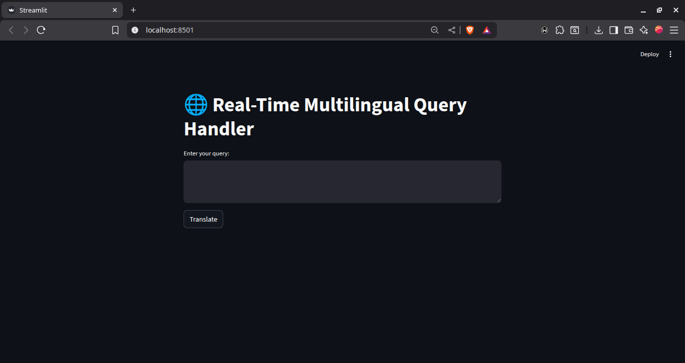
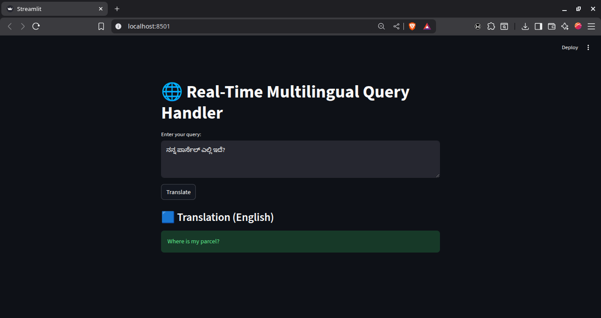

# 🌐 Real-Time Multilingual Query Handler

**A local, real-time translation tool designed to convert any input language instantly into English.**

This tool is built for global customer support, help desks, and multilingual query handling, providing a completely offline solution that requires no API keys, internet connection, or paid LLM services.

---

## 🚀 Features

* **Real-Time Translation (Any Language → English):** Utilizes the highly effective `Helsinki-NLP/opus-mt-mul-en` model to translate over 100 languages instantly.
* **100% Offline Operation:** Runs completely locally using HuggingFace Transformers and PyTorch (CPU-only), ensuring data privacy and uninterrupted service.
* **Clean, Simple Interface:** Built with **Streamlit** for a fast, modern, and user-friendly web interface.
* **Lightweight Architecture:** Simple deployment with no backend servers or complex APIs. The model loads once on startup and responds instantly to user queries.

---

## 🖥️ Screenshots

| Interface | Translation Result |
| :---: | :---: |
|  |  |

---

## 🛠️ Installation & Execution

Follow these steps exactly to set up and run the application locally.

### **Prerequisites**

* Python 3.8+
* The `requirements.txt` file must be present in the project root.

### **Setup Commands**

1.  **Create a virtual environment** to isolate the project dependencies:
    ```bash
    python3 -m venv venv
    ```

2.  **Activate the virtual environment**:

    * **macOS/Linux (Bash/Zsh):**
        ```bash
        source venv/bin/activate
        ```
    * **Windows (Command Prompt):**
        ```bash
        venv\Scripts\activate.bat
        ```

3.  **Install required dependencies** from `requirements.txt`:
    ```bash
    pip install -r requirements.txt
    ```

4.  **Run the Streamlit application**:
    ```bash
    streamlit run app.py
    ```

The application will automatically open in your default web browser (usually at `http://localhost:8501`).

---
